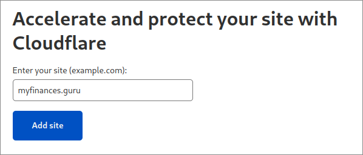
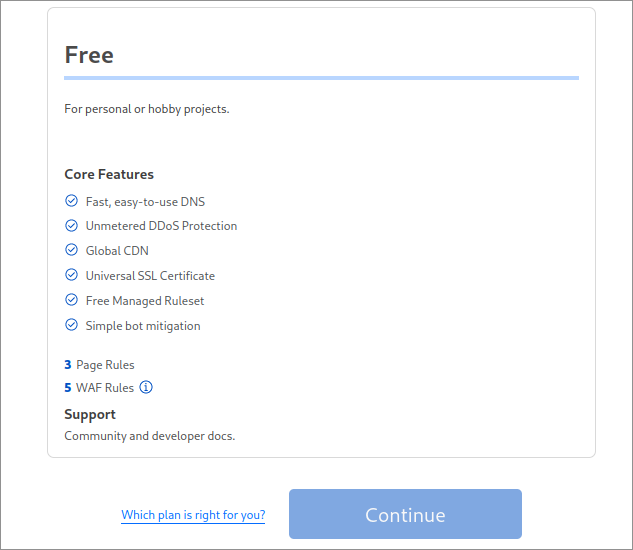
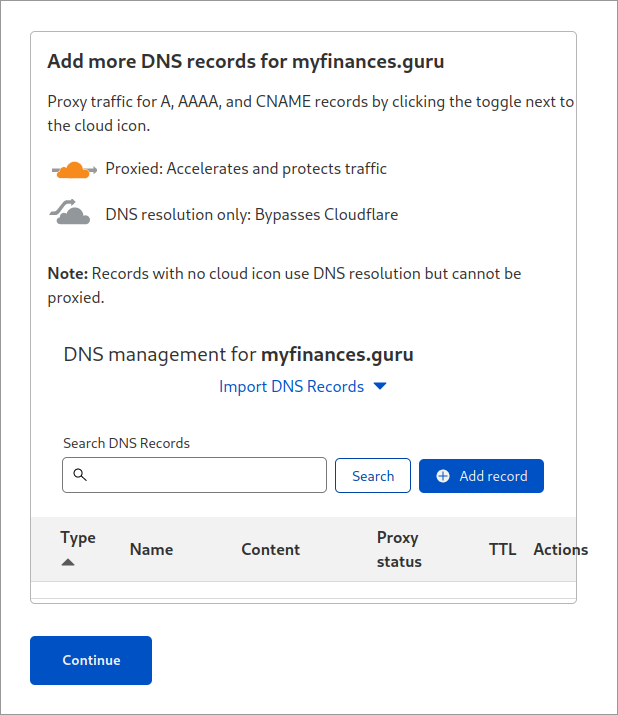
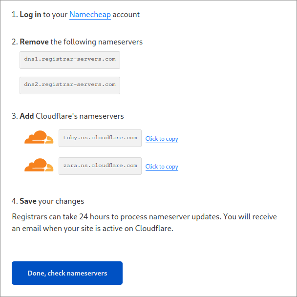
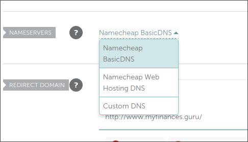
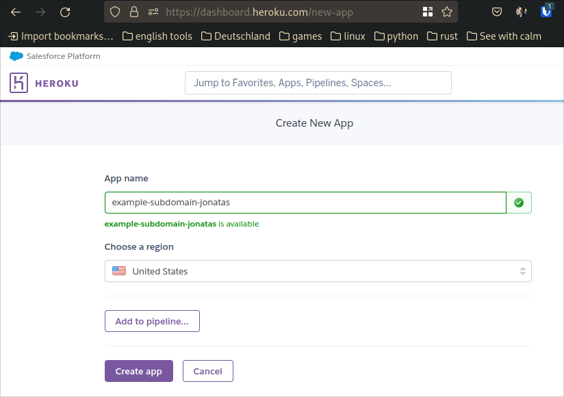
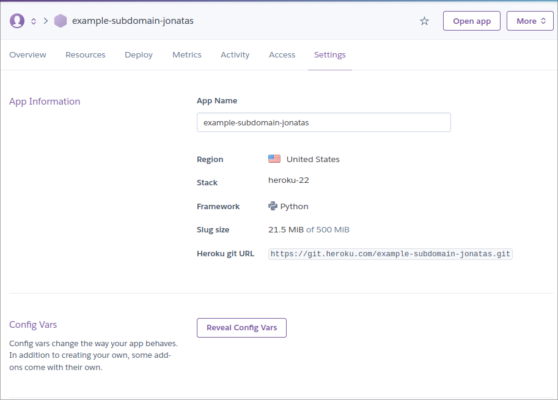
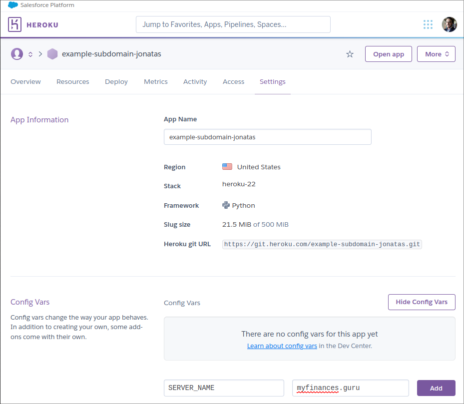

# Deploy flask application with subdomain on Heroku

Hello, I made a very detailed guide on how I uploaded an example project using Heroku and Cloudflare, I hope I can help you.

As a first step, let's create our project folder:
```shell
mkdir flask_example
```

In this example, we are going to use poetry to manage dependencies and for that, we need to install it via pip.
```shell
pip install poetry
```

Let's do the `poetry init` command to start our configuration, in this case, let's just follow its default configuration, as below:
```shell
❯ poetry init

This command will guide you through creating your pyproject.toml config.

Package name [flask_example]:  
Version [0.1.0]:  
Description []:  
Author [Jonatas Oliveira <contact@jonatasoliveira.dev>, n to skip]:  
License []:  
Compatible Python versions [^3.13]:  

Would you like to define your main dependencies interactively? (yes/no) [yes] 
You can specify a package in the following forms:
  - A single name (requests): this will search for matches on PyPI
  - A name and a constraint (requests@^2.23.0)
  - A git url (git+https://github.com/python-poetry/poetry.git)
  - A git url with a revision (git+https://github.com/python-poetry/poetry.git#develop)
  - A file path (../my-package/my-package.whl)
  - A directory (../my-package/)
  - A url (https://example.com/packages/my-package-0.1.0.tar.gz)

Package to add or search for (leave blank to skip): 

Would you like to define your development dependencies interactively? (yes/no) [yes] 
Package to add or search for (leave blank to skip): 

Generated file

[tool.poetry]
name = "flask-example"
version = "0.1.0"
description = ""
authors = ["Jonatas Oliveira <contact@jonatasoliveira.dev>"]
readme = "README.md"
packages = [{include = "flask_example"}]

[tool.poetry.dependencies]
python = "^3.13"


[build-system]
requires = ["poetry-core"]
build-backend = "poetry.core.masonry.api"
```

Now let's install the minimal packages for this example.
```shell
poetry add flask python-decouple python-dotenv gunicorn
```

Now we create the default directories for static and templates, this example we not use, but is good use with reference.
```shell
mkdir static template
```

Now let's create the default directories for static and template, in this example, we won't use them, it's more to use as a reference.
```shell
touch config.py app.py main.py
```

Now let's enter the shell and create the main.py file.
```python
import locale

from flask import Flask

import config as default_config


def create_app(config=None) -> Flask:
    locale.setlocale(locale.LC_ALL, "pt_BR.UTF-8")  # set locale
    app = Flask(__name__, static_folder="../static", template_folder="../templates")
    if config is None:
        config = default_config
    app.config.from_object(config)
    return app

```
Here I'm already using the flask's config template in a separate file, which isn't the simplest way to get started but is best for a project that expects to grow.

```python
def create_app(config=None) -> Flask:
```
Here we define our create_app function which is basically our app flask initialization function.

```python
app = Flask(__name__, static_folder="../static", template_folder="../templates")
```
Here I set the flask app and define the static_folder and the template_folder, in the API projects these settings can be optional.

```python
    if config is None:
        config = default_config
    app.config.from_object(config)
```
Here we configure the import of the config for the project, we could set the config directly in create_app but it is more organized to use a file just for organization.
As a parameter of create_app, we put config, in this case, it is set to none by default, this is especially important for testing, where we can configure an exclusive config for testing or if we want to separate the production config. So when calling the app we can pass the config we want.

```pyhton
    return app
```
Finally, we return the app we want.
For now, nothing works, but let's now create our default route using a blueprint.

Let's create the root_blueprint.py file,
```python
from flask import Blueprint

main_blueprint = Blueprint('Main Blueprint with root domain', __name__)

@main_blueprint.route('/')
def index():
    return "This is a main blueprint"

```

where:
```python
from flask import Blueprint

main_blueprint = Blueprint('Root route', __name__)
```
Here we import the Blueprint and define it as a description.

```python
@main_blueprint.route('/')
def index():
    return "This is a main blueprint"
```
Here we create our default route in "/" which is the root of the project.

Now let's register our blueprint in main.py
```python
    # Blueprints and API Namespaces
    from root_blueprint import main_blueprint
    app.register_blueprint(main_blueprint)
```

Let's create the app.py file so we can start our flask application using it.
```python
from main import create_app

app = create_app()
```

Now let's run our application by first starting the venv with poetry then let's set it to start in debug mode and run the flask.
```shell
poetry shell
export FLASK_DEBUG true
flask run
```

Run with localhost and see the message below appear:


Now let's configure the subdomain in the local environment.
Go to /etc/hosts and configure our domain and subdomain, it is important to try to use a non-valid domain on the internet because if, for example, you use google.com instead of directing you to the search engine, you will be directed to your address local, in this case, we will use mydomain as the domain.
```sudo vim /etc/hosts
...
127.0.0.1    subdomain.mydomain mydomain
```

Now let's create the blueprint subdomain_blueprint.py
```python
from flask import Blueprint

sub_blueprint = Blueprint('Subdomain route', __name__)

@sub_blueprint.route('/', subdomain='subdomain')
def index():
    return "This is a subdomain blueprint"

```
Note that in the blueprint decorator, we added `subdomain='subdomain'` which serves to indicate the subdomain that will be used.

Now in main.py let's register the blueprint
```python
    from sub_blueprint import sub_blueprint
    app.register_blueprint(sub_blueprint)
```

Now we need to configure our config.py to be able to recognize our locally created domain.
```python
from decouple import config

SERVER_NAME = config('SERVER_NAME')
```
Basically, we are going to use the python decouple lib so we can dynamically configure the SERVER_NAME.
Because of this, we will need to create a .env file with the name SERVER_NAME (it is important to put the .env in .gitignore as it cannot be uploaded to your repository)

```python
SERVER_NAME=mydomain:5000
```

now let's test the domain and subdomain in the browser.


Now let's upload this project to git and place the .env in .gitignore
```shell
echo '.env' > .gitignore
echo 'venv'  >> .gitignore
echo '__py_cache__' >> .gitignore
git add .
git commit -m " initial commit"
git push origin main
```

Go to namecheap and hire a domain following the site's standard procedure.


With the domain purchased, we will register it at Cloudflare by first adding the domain name and clicking on "Add a Site".






With the nameservers in hand, let's add it to NameCheap.




Now we go config Heroku.

It is necessary to [create a Heroku account](https://signup.heroku.com/) before continuing, creating the account we will log in and add the app by clicking on create a new app.

> [!warning] For create app
> You must first register a credit card on Heroku before proceeding, as there are no more paid plans now.


In the first step, put a name for your app and choose the region, then click on Create App.


On the next screen, we will choose the [heroku cli](https://devcenter.heroku.com/articles/heroku-cli) option to upload our application.

>[info] GitHub use
>For this example, we are going to use the Heroku CLI as it is the simplest method, but I strongly recommend making a pipeline using Git Hub, and if you need to know how to install the Heroku CLI, just follow the [instructions on the Heroku website](https ://devcenter.heroku.com/articles/heroku-cli), if you are using Linux I recommend using the tarball.

Before we continue to configure the CLI, let's put the requirements file, which Heroku will identify to deploy, as we use poetry, we need to export the file.
```bash
poetry export -f requirements.txt --output requirements.txt
```

Let's also create the Procfile so we can start our app using the app.py from the flask with gunicorn.
```shell
web: gunicorn app:app
```

Now let's configure the environment variable so that Heroku identifies the name of the server you want to use in my case I'm going to use myfinances.guru.
So let's click on Settings and then on Reveals Config Vars.


In the KEY field, we will put `SERVER_NAME` and in value, we will put the domain which in my case is `myfinances.guru`

Then just click on Add and in the sequence we will deploy.

To start the Heroku CLI, let's log in using the command below:
```shell
heroku login
```
It will display a link with a login page in your browser, so just copy and paste and follow the login procedure after you're done just go back to the terminal.

Let's add the latest changes to our main branch:
```shell
git add .
git commit -m "chore: add deploy configs"
git push origin main
```

Adding a remote for Heroku, in your app the configuration line will appear in my case it is the line below in your case it will be another line:
```shell
heroku git:remote -a example-subdomain-jonatas
```

Now just push to Heroku with the command below:
```shell
git push heroku main
```

>[info] Which branch to use for push?
>In my case, my branch on Git Hub is main, but on Heroku the example will appear as master, so always put the branch you are using on github.

When the deployment is finished it will display a heroku url for this project, in my case it looked like this:
`remote:        https://example-subdomain-jonatas.herokuapp.com/ deployed to Heroku`

Let's now indicate to Heroku that we are going to use an external subdomain in my case myfinances.guru according to the line below:
```shell
heroku domains:add myfinances.guru
```

Now with the `heroku domain` command we verify the target that it will generate to put in the DNS.


Now we also add our subdomain:
```shell
heroku domains:add subdomain.myfinances.guru
```
It will generate another target to be placed on CloudFlare.

Now we need to go to Cloudflare and configure this URL using CNAME, in my case it will look like the image below:


Now we need to wait a few minutes to propagate the DNS, but once the propagation is complete we can test our application using the domain.


With that I close this guide, if you need any other information please let me know.


-
## References
- [CloudFlare Documentation](https://developers.cloudflare.com/)
- [Heroku Documentation](https://devcenter.heroku.com/categories/reference)
