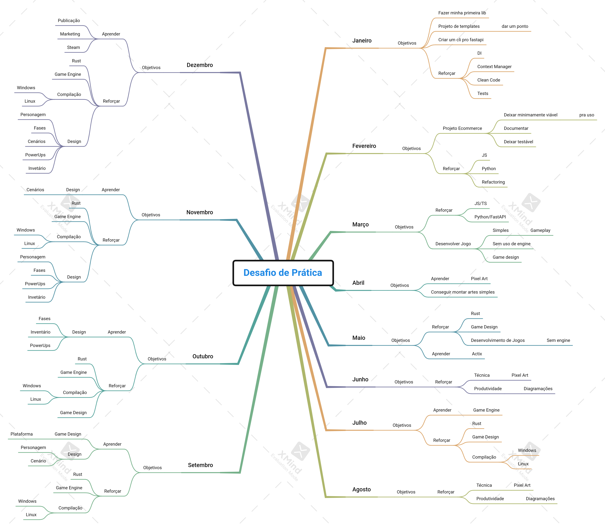

# Desafio de prática

Olá, bom estou oficialmente abrindo meu desafio de prática público de 2022.

## Como funciona?
As regras eu disponibilizei [nesse link](https://jonatasoliveira.dev/blog/desafio-de-pratica-regras/), ainda posso melhorar um pouco ele mas, o resumo está lá.

A idéia é fazer um compromisso público de alcaçar um objetivo, usando projetos no máximo mensais onde vou praticar determinadas habilidades para alçar um objetivo.

A ideia desse desafio é fazer um compromisso para praticar algumas habilidades, isso não contabiliza  horas de estudo especifico, durante cada sessão de prática ele vai ter objetivos e a ideia caso aconteça algum bloqueio é tentar se desbloquear apenas vendo as documentações de sistemas. 

Além disso trabalhando com projeto pequenos, tarefas como baby steps e feedback contínuo que eu chegue a um grau mais elevado de conhecimento no fim desse desafio, ou seja, a ideia é conseguir entrar muito melhor do que entrei.

## Meu desafio

Para 2022 preciso dar um ponto em alguns projetos que abri e também quero lançar meu primeiro jogo na steam. 
Então dividi os dois primeiros meses no ano para organizar 2 projetos que já tenho aberto, ai os próximos 10 meses vão ser focados no desenvolvimento de jogos e esses jogos vão tanto me ajudar a trabalhar habilidades que uso no trabalho quanto habilidades pro meu jogo.
Nesse ano vou focar em desenvolver pixel art e trabalhar com uma engine em rust pro meu jogo na qual vou compilar pra steam. Nesse desafio estou calculando investir 20 horas mensais de prática, que é o máximo que vou conseguir no momento.

Estou inicialmente pensando em fazer alguns jogos no estilo de livro-jogo texto, pois são bem simples e da pra fazer tudo com apenas programação, sendo que imagens seriam um plus, mas dentro desse desafio não pretendo eu mesmo criar os fluxos da história pretendo pegar pronto de algum amigo que se interessar =-).

## Projetos

** Janeiro **

Projeto do template fastapi, vou montar um cli pra criar um projeto simples e a evolução do exemplo usando a sessão dos dados como injeção de dependência. Além disso transformar isso numa lib e publica-la no pypi.

** Fevereiro **

Projeto do fast-ecommerce criar uma documentação em monorepo, adicionar testes via github actions e atualizar dependências com o mínimo de refatoração.

** Março **

Criar um livro-jogo usando vue/ts e python/fastapi.

** Abril **

Criar um pixel art pro jogo de Março, a abertura do jogo e o encerramento.

** Maio **

Criar um livro-jogo usando vue/ts e rust/actix.

** Junho **

Criar em pixel art 10 diagramações do jogo do mês anterior fora a abertura e o encerramento.

** Julho **

Criar um livro-jogo usando uma engine de games em rust no momento a mais provavel é a [bevy](https://bevyengine.org/).

** Agosto **

Criar em pixel art 20 diagramações do jogo do mês anterior fora a abertura e o encerramento.

** Setembro **

Criar um jogo simples de plataforma usando apenas uma tela.

** Outubro **

Criar um jogo simples de plataforma com uma fase e power-ups ou fazer essa evolução no jogo do mês anterior.

** Novembro **

Criar um jogo simples de plataforma com duas fases e power-ups ou fazer essa evolução no jogo do mês anterior.

** Dezembro **

Criar um jogo simples de plataforma com quatro fases e power-ups ou fazer essa evolução no jogo do mês anterior. Além de publicar ele na steam.

Todos os objetivos para cada projeto eu coloquei no mapa abaixo:

## Motivação

A ideia é conseguir provar uma tese que venho estudando em vários livros e cursos, onde direcionando meu estudo exclusivamente para pratica deliberada e através de projetos pequenos, com feedback rápido, fail fast e uma prática metódica eu consiga me desenvolver mais rapidamente.
E sim a ideia não é nem lançar curso e nem livro sobre aprendendo a aprender, mas sim tentar provar que com os conceitos que coloquei na minha postagem de regras vou conseguir aprender um conhecimento e fixa-lo mais rapidamente e assim conseguir ajudar outras pessoas com as postagens que eu for fazendo durante o 2022.

Bom os planos e retrospectivas dos projetos vou publicando aqui e vou tentar sempre que possível compartilhar no [twitch](https://www.twitch.tv/devjonatas), bom é isso por enquanto e até 2022.
